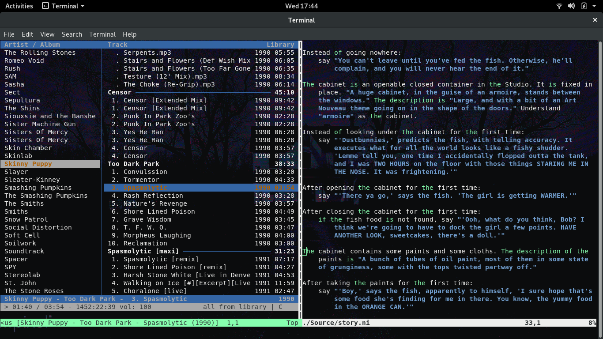
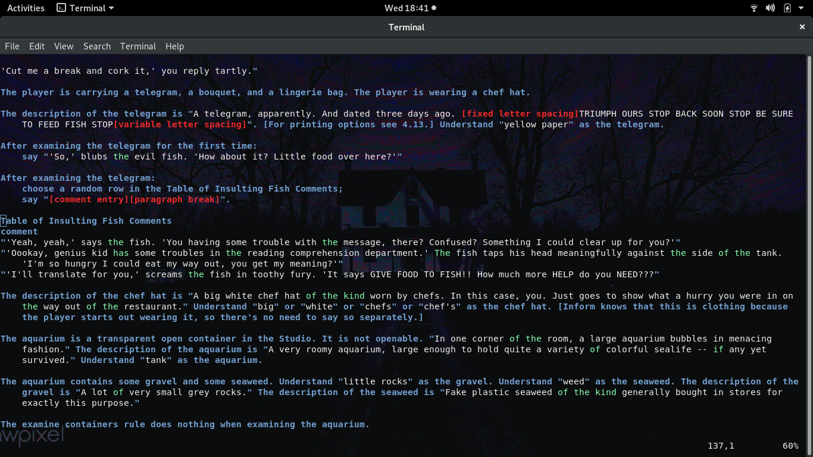
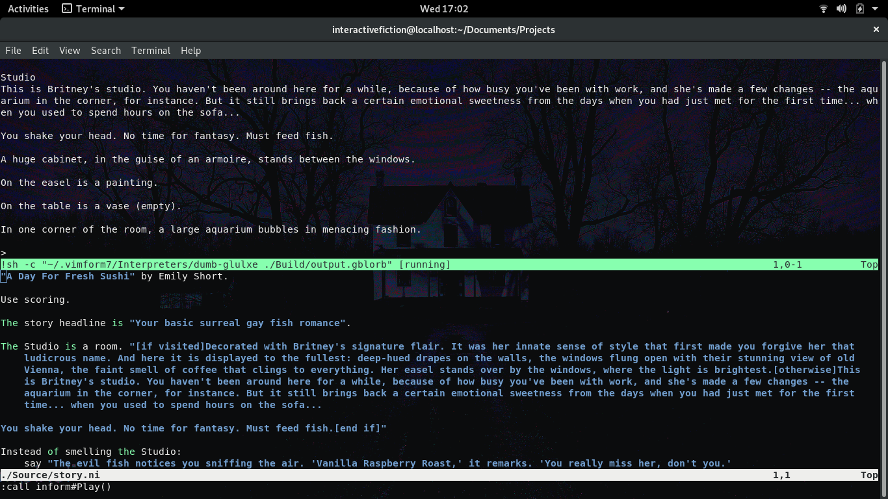
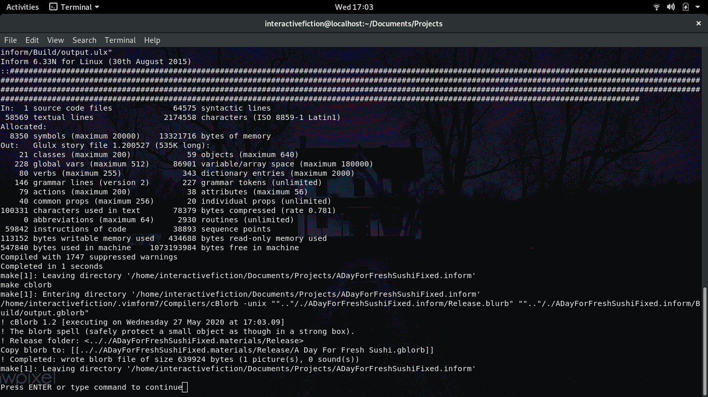
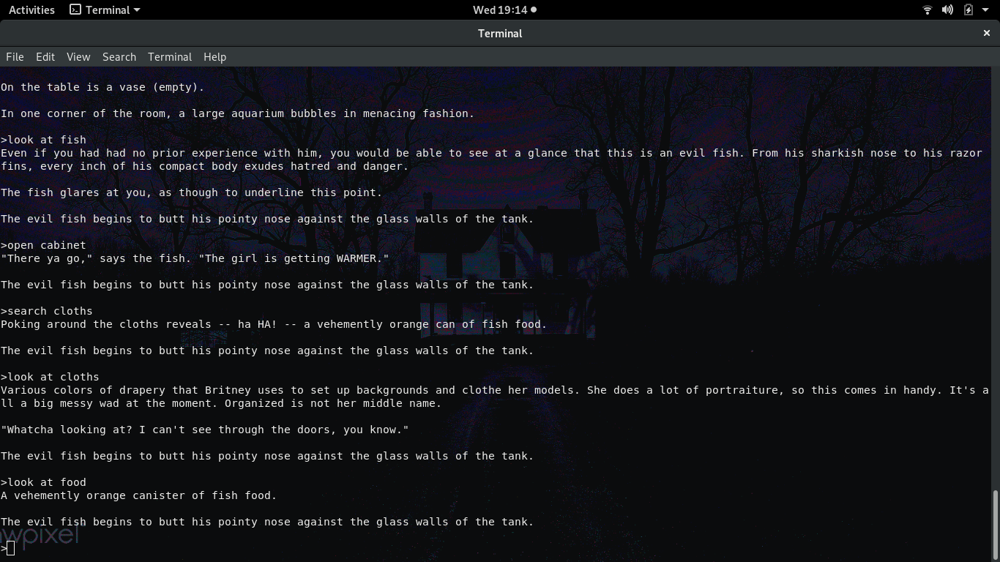
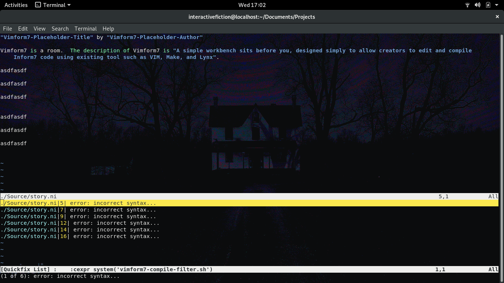
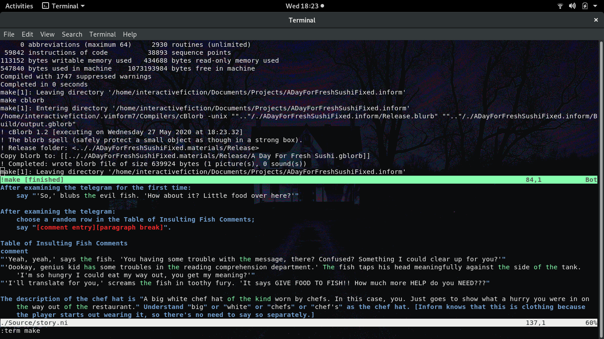
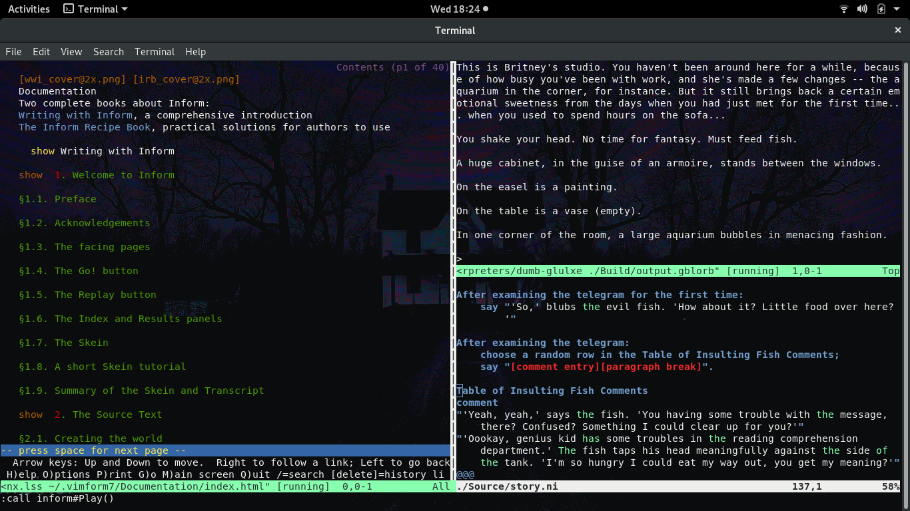

.. Vimform7 documentation master file, created by
   sphinx-quickstart on Wed May 20 15:49:01 2020.
   You can adapt this file completely to your liking, but it should at least
   contain the root `toctree` directive.

.. toctree::
   :maxdepth: 3

####################################
Overview
####################################

Vimform7 is an open source terminal based *Linux* development environment for Inform7 projects.  It provides all core functions required to author interactive fiction works in the Inform7 language.  As its name implies, Vimform7 makes use of the **Vim 8.x** editor to provide its functionality.  Vim itself is a highly configurable text editor built to enable efficient text editing.  It has a small memory footprint and excels at handling very large text files.  Vimform7 makes use of Vim configurability by adding a plugin that enables users to develop Inform7 projects.  In order to allow viewing of HTML help documents from within Vim, Vimform7 uses the Lynx text mode browser.  When compiling Inform7 projects Vimform uses standard make utilities in conjunction with Inform7 CBlorb, inform6 and ni compilers.

.. image:: imgs/vimform7intro.png
   :alt: Vimform7 environment with help documentation and code editor open.

Features
===============

Vimform7 provides the essential capabilities needed to author an interactive fiction work.  With Vimform7 you can:

* Compile your Inform7 source code.
* Debug your Inform7 code and jump directly to error in the source.
* Work with existing Inform7 projects.
* Test your Inform7 projects (text only projects at this time).
* Read the Inform7 help documentation.
* Customize the look and feel of the editor.
* Add your own custom short cuts and commands to aid in your development efforts.
* Package your customizations as a new Vimform7 distribution to give to others or to replicate your custom environment on a new system.

####################################
Usage
####################################

Vimform7 has a limited desktop launcher that opens the last project you edited.  This is convienent when you are working on a larger more long term project and prefer to not have to open the console in order to launch Vimform7.  For all other operations, Vimform7 is used from the command line directly. The sections below provide more details on how to obtain Vimform7, how to install / uninstall it, and these two modes work.

Installation & Removal
======================

Vimform7 distributions are provided as compressed archives available on the Vimform7 github builds page.  Installation requires the archive to be decompressed to a temporary location and then an installation script is run to perform the necessary setup steps.  Similar to installation, uninstallation is performed by executing a script as well. Some key aspects of the Vimform7 installation are as follows:

* Vimform7 will not conflict with existing gnome-inform7 or other IF compilers that are installed on your system.  For example, gnome-inform7 and Vimform7 can coexist on the same system with no issues.
* Vimform7 will install OS packages for vim, lynx, make, and uuidgen.  If your OS does not provide these packages Vimform7 will not install.
* Vimform7 itself is built entirely on shell scripts and vim scripting languages.  All scripts / plugins are installed within your home folder structure.

Downloading An Archive
======================

All official Vimform7 archives are available at the vimform7-builds github.  You can either clone the git repository or simply download a snapshot of the repository in zip format.

Installation Process
====================

Vimform7 takes a few steps to install.  First you need to download an archive, second the archive must be extracted, and third a script must be run to perform the installation.

Removal Process
===============

You can remove Vimform7 from your system by running the vimform7-uninstall.sh script.  This script can be found in two places: 1) The root of the original archive that Vimform7 was installed from, 2) In the ~/.vimform7/Vimform7 folder on the system where Vimform7 was installed.

Desktop Launcher
================

The desktop launcher provided by Vimform7 simply opens the last project opened by the user.  Immediately after installation, using the desktop launcher will result in opening a simple test IF project.  To change the project opened by the desktop launcher use the vimform7-open-prj.sh script to open a different project from the commandline.  After doing this, the next time you use the desktop launcher the new project will be open by default.  On gnome a gnome desktop the launcher can be found by pressing the super key and then typing vimform7 in the find window.

.. image:: imgs/vimform7desktop.png
   :alt: Vimform7 desktop launcher used to open most recent project.

Command Line Tools
==================

Vimform7 provides several command line tools that are used to manage and create Inform7 projects.  When working with existing Inform7 projects the vimform7-port-prj.sh script is helpful in auto-generating a new custom makefile for your project so it may be built using Vimform7 from within Vim or simply by calling make from the commandline in the projects <PROJECTNAME>.inform folder from the commandline.  When working on new projects the vimform7-create-prj.sh is helpful in creating a brand new <PROJECTNAME>.inform7 directory, uuid, and makefile.  Opening an existing project is accomplished by using vimform7-open-prj.sh.

.. list-table:: Vimform7 Command Line Tools
   :widths: 25 50 25
   :header-rows: 1

   * - Vimform7 Script
     - Purpose
     - Common Usage
   * - vimform7-create-prj.sh
     - Create a new Inform7 project.
     - -n="<NAME>"
   * - vimform7-make-distro.sh
     - Make a new Vimform7 distribution.
     - -n="<NAME>"
   * - vimform7-open-prj.sh
     - Open an existing Inform7 project.
     - -f="./<PROJECTFOLDER>/"
   * - vimform7-port-prj.sh
     - Convert an existing Inform7 project.
     - -f="./<PROJECTFOLDER>/"

Editing Tools
=============

Vimform7 provides tools that are integrated into the Vim environment via Vim plugins.  These tools are envoked using various key combinations.  The following table lists all Vimform7 key combinations that can be used while editing an IF work from within Vim.

.. list-table:: Vimform7 Vim Key Combinations
   :widths: 25 75
   :header-rows: 1

   * - Vim Key Combination
     - Purpose
   * - -7h
     - Open a vertical pane with Inform7 help docs. 
   * - -7p
     - Open a horizontal pane to play your latest IF build.
   * - -m
     - Compile your IF work in a new full sized window.
   * - -d
     - Compile your IF work in a new horizontal pane.
   * - -l
     - List all errors in your IF work and jump to error in source.
   * - -t
     - Compile and then test your IF work in a new full sized window.

####################################
Customization
####################################

Vimform7 is meant to be customized.  Users can feel free to modify the various scripts that make up the Vimform7 tool set as well as the plugins that integrate Vimform7 with Vim.  Your customizations can also be packaged into a new Vimform7 distribution that can be used to share your work or to simply reproduce your configuration in a new computing environment.  If your customizations could be useful to others, the Vimform7 project welcomes contributions to the toolset via the github pull request workflow.

File Structure
==============

All files installed by Vimform7 are located in the users home directory.  A map that summarizes the locations of key files that may be of interest to users is given below.  Files and folders in ~/.vim are related to the Vimform7 Vim plugin implementation.  Files and folders in ~/.local are related to the integration of Vimform7 with your OS desktop and terminal.  Files and folders in ~/.vimform7 are related to the operation of Inform7 and are derived from `gnome-inform7 <https://github.com/ptomato/gnome-inform7>`_ with the exception of the Vimform7 folder which contains files related to creating new custom distributions of Vimform7 by users and some configuration files as well.
 
.. image:: imgs/vimform7treelarge.png
   :alt: Vimform7 key folders under users home directory after installation.

Making A Distribution
=====================

A new vimform distribution can be quickly created using the vimform7-make-distro.sh script.  Running the script without any parameters will automatically name the vimform distribution using the time and date.  The new distribution contains all changes made to an exiting installations vim plugins, shell scripts, and entire contents of the ~/.vimform folder.

How To Modify Vimform
=====================

Modifying Vimform involves editing the various scripts that are part of the Vimform installation.  For example to customize the Vimform7 commandline tools one would edit the various vimform7* scripts in the ~/.local/bin folder.  Alternatively, editing the Vimform7 Vim plugins would involve modifying the inform* files present in the subdirectories of the ~/.vim folder.  In general some trial and error will be required as changes are tested and further modifications are implemented until the desired behavior is achieved.  It is always a good idea to keep the original scripts as a backup and/or the original installation archive handy in the event a Vimform7 script becomes broken.  One way to make a quick backup of your current installation is to run the vimform7-make-distro.sh script.  Vimform7 can be installed on top of itself and will overwrite existing files during installation on a system that already has Vimform7 installed.

How To Edit Vimform7 Vim Plugins
================================

To get started with editing the Vimform7 Vim plugins, if you are not familiar with Vim customization, you should take a look at the section `Tuning Vim <https://vimhelp.org/usr_toc.txt.html#usr_toc.txt>`_ in the Vim Reference Manual.  `Making New Commands <https://vimhelp.org/usr_40.txt.html#usr_40.txt>`_ describes how to add new command key sequences to Vim.  Vimform7 is provided with a number of custom commands to allow for the compilation and debug of Inform7 works.  `Your Own Syntax Highlighted <https://vimhelp.org/usr_44.txt.html#usr_44.txt>`_ describes how to implement your own custom syntax highlighter for any language you like (including Inform7).  Vimform7 is provided with a basic syntax highlighter as an example of how to get started.

.. _vimform-plugin-files:

.. list-table:: Vimform7 Vim Plugin Files
   :widths: 25 75
   :header-rows: 1

   * - Vim Plugin FIle
     - Purpose
   * - ~/.vim/syntax/inform7.vim
     - Implements the Vimform7 Inform7 Vim syntax highlighter. 
   * - ~/.vim/autoload/inform.vim
     - Implements all Vimform7 Vim commands.
   * - ~/.vim/ftdetect/inform7.vim
     - Implements file type detection for Vimform7.

How To Edit Vimform7 Scripts
============================

To get started with editing the Vimform7 command line scripts, if you are not familiar with shell scripting, you should take a look at the `Bash Reference Manual <https://www.gnu.org/software/bash/manual/bash.html>`_.  This manual details all commands and concepts used to author the Vimform7 shell scripts.  Vimform7 provides a number of shell scripts that are located in ~/.local/bin and ~/.vimform7/Vimform7.  Those scripts located in ~/.vimform7/Vimform7 are generally only used for installation, uninstallation, and as templates during the process of creating a new distribution.  The scripts located in ~/.local/bin are those scripts that will be most commonly used on a regular basis when interacting with Vimform7.  To make modifications to a script simply open it up in your favorite editor, implement your changes, and the test them by using the script from the command line as you would normally.

.. _vimform-script-files:

.. list-table:: Vimform7 Script Files
   :widths: 50 50
   :header-rows: 1

   * - Vimform7 Script
     - Purpose
   * - ~/.local/bin/vimform7-create-prj.sh
     - Create a new Inform7 project with autogenerated makefile.
   * - ~/.local/bin/vimform7-make-distro.sh
     - Make a new Vimform7 distribution from existing installation.
   * - ~/.local/bin/vimform7-open-prj.sh
     - Open an existing Inform7 project inside Vim
   * - ~/.local/bin/vimform7-port-prj.sh
     - Convert an existing Inform7 project to work with Vimform7.
   * - ~/.local/bin/vimform7-common.sh
     - Contains some common functions used by all scripts.
   * - ~/.local/bin/vimform7-compile-filter.sh
     - Compiler output filter to enable jump to error in Vim. 

Example Of Adding A Music Player To Vimform7
============================================

The following example is a step-by-step tutorial that provides an introduction to editing the Vimform7 Vim plugins and the Vimform command line scripts. By the end of the example you will have added a new key command to use within Vim that activates a console based music player and will have added that dependency to the vimform installation script.  

It is always good to do a bit of planning before starting your work.  Here are some things to consider before you start adding a feature to Vimform7.

* What specifically am I trying to add to Vimform7?  Is it a new vim command?  Is it a change to the command line scripts?  Perhaps both?  What specifically is the change intended to do?
* What vim plugin files will I need to change (if any) to accomplish my goal?
* What command line scripts will I need to change (if any) to accomplish my goal?
* What changes should I make to each file I have identified?
* Are my changes specific to my computing environment or are the general and perhaps useful to all Vimform7 users?
* How will I test my changes that I have made?

Lets start by making a small list that includes our goal, files we plan to edit, and why those particular files should be edited.  This list will serve as a basic roadmap for our work.  Hopefully, the same overall approach can be reused to implement other features you may need to add to Vimform7 as well.  You may find it helpful to refer to :ref:`vimform-script-files` and :ref:`vimform-plugin-files` to determine what files may be important to modify as part of your work.

.. list-table:: Plan To Add CMUS to Vimform7
   :widths: 25 50 25
   :header-rows: 1

   * - Task
     - Description
     - Test Plan
   * - Define feature.
     - Integrate CMUS with Vimform7.
     - Command -a will open CMUS in vim.
   * - Scripts Affected.
     - vimform7-install.sh CMUS dependecy.
     - Check for CMUS package.
   * - Plugins Affected
     - ~/.vim/autoload/inform.vim -a code.
     - Run Vimform7 to try -a.
   * - Validation
     - Try new install of Vimform7.
     - Use vimform7-make-distro.sh.

Before we get started on each task, it might be helpful to get your system navigated to the various directories where Vimform7 is installed.  You can either open up individual file browsers to each folder or get a few terminals open to the various folders.  The folders you will need are ~/.vim, ~/.vimform7/Vimform7, and ~/.local/bin.

**Define Feature** - To get started lets state exactly what we are trying to do.  The goal here is to integrate the CMUS console base music player with Vim via a command added to the Vimform7 plugins and scripts.  If you are not familiar with CMUS you might want to check out the `CMUS Github <https://cmus.github.io/>`_.  To envoke the CMUS player users will issue the **-a** command while inside of the Vim editor.  With all of this stated we have a clear picture of what we are trying to accomplish.

**Scripts Affected** - Since we are adding the CMUS music player to Vimform7 we need to address the fact that this is a new external dependency for Vimform7.  To add this new dependency to Vimform7 installer we need to be sure the changes are made to the Vimform7 installer.  The installer can be found at ~/.vimform7/Vimform7/vimform7-install.sh.  The changes required are not very complicated.  Inside the script goto the section of the code where it checks for system dependencies.  An exerpt of this section is provided below for your reference.  In the exerpt below, refer to lines 14,15 and 27,28.  These are the lines you will need to add to your vimform7-install.sh script to ensure that the dependency is handled properly when the installer is run on a new operating system.

.. code-block:: bash
   :linenos:
   :emphasize-lines: 14, 15, 27, 28

	echo " - Checking for system dependencies."
	echo ""
	if [ ! -f $DEBDISTRO ]; then
		echo " - RPM Based distribution detected."
		echo ""
		testpkg="vim-enhanced"
		check_rpm_dep $testpkg
		testpkg="lynx"
		check_rpm_dep $testpkg
		testpkg="make"
		check_rpm_dep $testpkg
		testpkg="util-linux"
		check_rpm_dep $testpkg
		testpkg="cmus"
		check_rpm_dep $testpkg
	else
		echo " - DEB Based distribution detected."
		echo ""
		testpkg="vim"
		check_deb_dep $testpkg
		testpkg="lynx"
		check_deb_dep $testpkg
		testpkg="make"
		check_deb_dep $testpkg
		testpkg="uuid-runtime"
		check_deb_dep $testpkg
		testpkg="cmus"
		check_deb_dep $testpkg
	fi

**Plugins Affected** - Since we are adding a new command to Vim so we can open up the CMUS music player while we are authoring our interactive fiction works, we will need to make some edits to the ~/.vim/autoload/inform.vim file.  These edits can be appended to the end of the file.  To add -a functionality to open the CMUS music player add the following lines to the inform.vim file.

.. code-block:: bash
   :linenos:
   :emphasize-lines: 1, 2, 3, 4

	function! inform#MUSIC()
	    :vert term cmus
	endfunction
	noremap -a :call inform#MUSIC()<CR>

**Validation** - Now that we have made the changes to Vimform7 to add the desired CMUS functionality, it is time to test them out.  Start out by simply opening a fresh instance of Vimform7 to your favorite or last used project.  Now try the -a command and see what happens.  Note that if you have never used CMUS before you will need to populate it with your local music selection.  Following this `CMUS Tutorial <https://linux.die.net/man/7/cmus-tutorial>`_ should be helpful in getting your music populated into CMUS.  Be sure to give CMUS enough time to populate the music index with the data from your library.  If you have a large collection it can take a little while and CMUS is not very explicit in telling you how much progress it has made with respect to adding your music, so be patient.  Once your music is added to CMUS, try testing again.  Open a fresh instance of Vimform7 and try the new **-a** command you have added.  If everything worked correctly, you should see your music collection in the new vertical pane that was created.  Now that you have verified the new feature works, it is an ideal time to run the vimform7-make-distro.sh script to capture a snapshot of your work.  If you were planning to make a pull request with these changes, the next step in testing would be to install your newly created distribution to be sure that it would work properly for people installing Vimform7 for the first time.  One of the ways to do this is to create a virtual machine for Ubuntu, Fedora, and other operating systems that you can use for this type of final testing.  Virtual machines offer the ability to set restore points making it easy to move back to a pristine installation of the operating system under test.  If you intend to contribute to Vimform7 regularly, it is worth making the time investment to create this kind of testing environment.

This concludes the working example.  Hopefully this has helped to shed light on how Vimform7 works, how to add commands to the Vim interface, how to add new dependencies, and how test and prepare for integrating your changes with the Vimform7 project on github.  Thanks for helping to make Vimform7 better for everyone!

####################################
Source Code
####################################

The source code for Vimform7 is not very different from the scripts that are part of a Vimform7 installation.  The major difference between the source repository and an installation are the directories that the various Vimform7 elements reside in.  This is because Vimform7 is not a compiled program.  It only relies on shell scripts and Vim extenstions (written in a Vim scripting language) to provide its functionality.  While it is possible to create a distribution from the source tree it is more common to build a distribution from a modified installation.  Building a distribution from a modified installation is usually prefer because it allows for realtime editing / modification of all Vimform7 scripts and rapid packaging of those changes for distribution.

Obtaining Source
================

Vimform7 is an open source project and all code for it may be obtained from the `Vimform7 Github Repository <https://github.com/interactivefiction/vimform7>`_.  The repository may be cloned or a zip file can be downloaded directory.  

Working With Source
===================

The main reason to work with Vimform7 source code directly is to facillitate a git pull request.  If you have created enhancements to Vimform7 that you feel are useful to all Vimform7 users perform the following steps to populate the source tree with your changes.

* Start by implementing all of your desired modifications in an existing Vimform7 installation.
* Test all of your changes on your local installation to be sure everything works as expected.
* Run vimform7-make-distro.sh to package your changes.
* Move the resulting zip file to a temporary directory and extract it to gain access to the contents.
* Copy vimform7-core.tar.xz, vimform7-libs.tar.xz, and vimform7-vimplugins.tar.xz into your git clone of the Vimform7 repository.
* Delete the corresponding vimform7-core, vimform7-libs, and vimform7-vimplugins folders that are currently in the git repository.
* Extract the contents of vimform7-core.tar.xz, vimform7-libs.tar.xz, and vimform7-vimplugins.tar.xz into the git repository.
* Delete vimform7-core.tar.xz, vimform7-libs.tar.xz, and vimform7-vimplugins.tar.xz from the repository.
* Now you are ready to check in your code to your fork of the Vimform7 repository and to make a git pull request.

Distribution From Source
========================

To make a distribution archive from source you can use the vimform7-make-distro-from-source.sh script that is available in the root of the source repository.  This script works the same as vimform7-make-distro.sh; however, it will create the distribution using the contents of the source directory rather than the installed components of Vimform7.  This script can be helpful when testing out your own controbutions to Vimform7.  To verify that you have included all the modifications in the Vimform7 source tree needed for your customizations, simply try making a distribution from the source and then test the installation to make sure everything works as you expect.  If this test passes you are ready to make a git pull request.

Contributing
============

Anyone can contribute to Vimform7.  Any source code, script, or modification to Vimform7 will be made open source.  To get started visit the `Vimform7 Github Repository <https://github.com/interactivefiction/vimform7>`_. 

Forking Vimform
===============

If you are familiar with Github workflows and terminology you can probably skip this section.  However, if you are new to programming and unfamiliar with Github this section may be helpful to you.  First off, what is Github?  Overall, Github is a service that allows developers to store and collaborate on source code.  It is based on a source code management toolset called "git".  The documentation you are reading now and the source code for Vimform7 are all hosted on Github.  So, what does it mean to "fork" Vimform7?  `Forking <https://guides.github.com/activities/forking/>`_ in Github is a procedure through which you make a copy of a project so you may modify it for your own purposes. 

Issuing A Pull Request
======================

Any modifications you make to Vimform7 can be submitted back into the Vimform7 project through a `Pull Request <https://guides.github.com/activities/forking/#making-a-pull-request>`_. Pull requests consist of a few process steps one of which is review of the changes you are making.  To expedite integration of a pull request it is good to do some upfront work such as:

* Test your changes on major Linux operatings systems.  Does your solution work on Ubuntu, Fedora, Linux Mint, Debian, etc?
* Use your changes for a while before you consider making a pull request if they are adding significant functionality.
* Comment your code to explain what is being done.
* Offer a test build of your solution for others to test drive themselves on your own github page.

For minor changes this level of testing would really not be needed, so remember, at the end of the day just use your best judgment regarding how far you really need to go to validate your work.  And most of all, thanks for your help making Vimform7 a better tool for everyone!  

####################################
Screen Shots
####################################

Desktop Launcher
================

**Envoking the desktop Vimform7 launcher**

Vim Commands
============

**Envoking the -7h command**

.. image:: imgs/vimform7-7h.png
   :alt: Vimform7 with editor and help panes open.

**Envoking the -7p command**

**Envoking the -m command**

**Envoking the -t command**

**Envoking the -l command**

**Envoking the -d command**

**Envoking the -7h and then -7p command**

####################################
Resources
####################################

The following section provides a number of links and information about Vimform7, Inform7 itself, and the technologies Vimform7 uses.

Resources
====================

* `Inform7 - A Design System For Interactive Fiction <http://inform7.com/>`_
* `gnome-inform7 - An Interactive Fiction IDE for Inform7 <https://github.com/ptomato/gnome-inform7>`_
* `Vim - A Highly Configurable Text Editor <https://www.vim.org/>`_
* `Lynx - A Text Browser For The World Wide Web <https://lynx.browser.org/>`_
* `GNU Make - A Tool That Generates Executables <https://www.gnu.org/software/make/>`_
* `GNU Bash - The sh-compatible Bourne Again SHell <https://www.gnu.org/software/bash/>`_

Licensing
=========

All scripts **unique** to Vimform7 are provided under the `MIT license <https://opensource.org/licenses/MIT>`_ provided in text form below.  This includes ~/.local/bin/vimform7* files, ~/.local/share/applications/vimform7.desktop, ~/.local/share/icons/vimform7.png, ~/.vim/autoload/inform.vim, ~/.vim/ftdetect/inform7.vim, ~/.vim/syntax/inform7.vim, and files within ~/.vimform7/Vimform7 that are provided as part of an official Vimform7 archive.  

All other files within ~/.vimform7 outside of ~/.vimform7/Vimform7 are provided under the licenses detailed inside the ~/.vimform7/Documentation/licenses folder on your local installation.

**Vimform7 License**

Copyright 2020 vimform7@gmail.com

Permission is hereby granted, free of charge, to any person obtaining a copy of this software and associated documentation files (the "Software"), to deal in the Software without restriction, including without limitation the rights to use, copy, modify, merge, publish, distribute, sublicense, and/or sell copies of the Software, and to permit persons to whom the Software is furnished to do so, subject to the following conditions:

The above copyright notice and this permission notice shall be included in all copies or substantial portions of the Software.

THE SOFTWARE IS PROVIDED "AS IS", WITHOUT WARRANTY OF ANY KIND, EXPRESS OR IMPLIED, INCLUDING BUT NOT LIMITED TO THE WARRANTIES OF MERCHANTABILITY, FITNESS FOR A PARTICULAR PURPOSE AND NONINFRINGEMENT. IN NO EVENT SHALL THE AUTHORS OR COPYRIGHT HOLDERS BE LIABLE FOR ANY CLAIM, DAMAGES OR OTHER LIABILITY, WHETHER IN AN ACTION OF CONTRACT, TORT OR OTHERWISE, ARISING FROM, OUT OF OR IN CONNECTION WITH THE SOFTWARE OR THE USE OR OTHER DEALINGS IN THE SOFTWARE.
